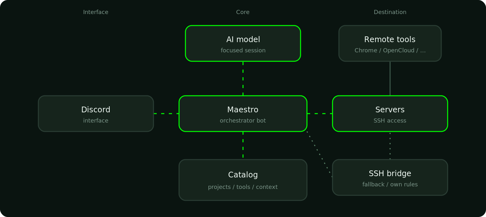

# Maestro

  

Discord ultra-orchestrator: turn an admin request into a focused agent session with project catalog, context packs, and strict safety rules. Persistent Discord threads stay bound to that session.

## Why it exists

Ops work used to mean: open a terminal, SSH to the right host, find the project, rebuild context from memory, spawn a disposable agent, and re-explain stack and quirks every time. When the chat ended, the context was gone.

Maestro keeps that loop in Discord. The admin speaks with slash commands or natural language. Maestro resolves the project from the catalog, injects the matching context pack, opens a scoped session, and reaches the host over SSH so the agent runs in the correct tree. The Discord thread and the Cursor chat stay linked, so work can resume later without starting from zero.

## How it flows

Operator request path: Luipy → Discord → Maestro (catalog) → cursor-agent on lu-zero → fleet hosts over SSH. Side tools sit beside that path: Redmine notes, OpenCloud hangar, chrome-mcp, and Archify maps.

  

| Lane | Role |
|------|------|
| **Operator path** | Discord slash / NL / threads → Maestro → Catalog → cursor-agent |
| **Fleet reach** | SSH to catalog hosts; chrome-mcp on amvara2 for real browser |
| **Side tools** | Redmine (MaestroBot), OpenCloud Space, Archify diagrams |

Interactive HTML + JSON source: `docs/archify/maestro-runtime.architecture.*`. What is not in the catalog does not exist for Maestro.

## Horizontal access (not just one folder)

A free agent only sees the folder where it was started. Maestro already has the fleet map: which host holds which project or tool, and how to call it.

In one thread it can work a project on host A, then use a tool that lives on host B, without installing anything new. Examples:

- **Browser** — `chrome-mcp` (preferred) or `selenium-chrome` for real UI checks, screenshots, login flows
- **OpenCloud hangar** — Maestro Space over WebDAV (`human_input/` → Maestro, `maestro_input/` → humans, `others/`)
- **Tracker / mail / ops** — Redmine notes, host journals, certs, service health, and other catalogued services

Same thread: read a log here, execute there, return one answer.

## Capabilities

| Capability | What it does |
|------------|----------------|
| **NL + slash** | Natural language and slash commands in the same home channel or persist thread |
| **Persistent sessions** | Discord threads bound to a resumable Cursor chat (`/ca_persist`, follow-ups, busy queue) |
| **Attachment ingest** | Reads images, screenshots, logs, PDF, and text-like files from the message |
| **Outbound media** | Attaches agent files from `data/outbound/` (images, JSON, HTML, PDF, logs, …) to the Discord reply |
| **File hangar** | Lists / downloads / uploads via OpenCloud WebDAV (survives Discord attachment TTL) |
| **Remote tools** | Invokes fleet services already on catalog hosts (Chrome, OpenCloud, …) over SSH |
| **Traceability** | Writes Redmine journal notes; can use existing mail infra when the case needs it |
| **Host ops** | Inspects journals, certificates, and service failures; fixes what is in scope |

## Commands

| Command | What |
|---------|------|
| `/help` | Short guide |
| `/ping` | Latency check |
| `/list_projects` `[host]` | Catalogued projects |
| `/ca` | One-shot cursor-agent |
| `/ca_persist` | Thread + resumable Cursor chat |
| `/stop_ca` | Stop this thread's run + clear its queue |
| `/thread_end` `[clean]` | Close session, summarize, delete the thread (`clean` skips Redmine) |
| `/restart_maestro` | Restart the bot (**admin only**) |
| `@Maestro` / reply | Natural language → usually `ca_persist` |

## Layout

| Path | Role |
|------|------|
| `maestro/` | Bot runtime |
| `catalog/hosts/` | Project index (JSON) |
| `contexts/` | Per-project `CONTEXT.md` packs |
| `prompts/` | Agent / NL router prompts |
| `.cursor/` | Rules and skills |
| `docs/` | Brand art + flow PNG |
| `docs/archify/` | Archify runtime map (JSON / HTML / visual-check) |
| `systemd/maestro.service` | Service unit |
| `.env.example` | Secret keys (copy to `.env`) |

## Setup

1. Copy `.env.example` → `.env` and fill Discord (and optional Redmine / OpenCloud) values.
2. Adjust `config.json` (guild / channel / homes / `allowed_user_ids`).
3. `python3 -m venv .venv && .venv/bin/pip install -r requirements.txt`
4. Install and enable `systemd/maestro.service` (edit paths if needed).
5. Restart with Discord `/restart_maestro` (or host CLI `python -m maestro.restart_guard operator` when not in an agent session).

## Safety

- Never commit `.env`, `data/`, or `.venv/`.
- Agents must not restart the service; only the admin does.
- Do not post secrets to Discord.
- Do not wipe end-user data without a scoped admin confirmation.
